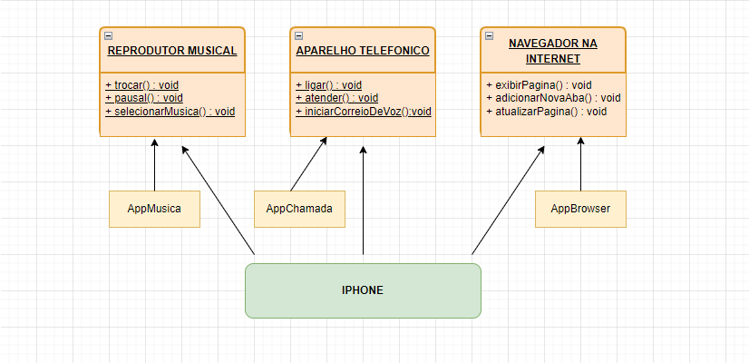

## Iphone UML Diagram:

# Projeto de Uso de Interfaces

Este é um projeto simples que demonstra o uso de interfaces em Java para representar funcionalidades de um reprodutor musical, um aparelho telefônico e um navegador de internet. Além disso, há uma classe `Iphone` que implementa todas essas interfaces, representando um dispositivo móvel que possui todas essas funcionalidades.

## Classes e Interfaces

### `AppMusica`

Uma classe que implementa a interface `ReprodutorMusical` para reproduzir música.

### `AppChamada`

Uma classe que implementa a interface `AparelhoTelefonico` para realizar chamadas telefônicas.

### `AppBrowser`

Uma classe que implementa a interface `NavegadorInternet` para navegar na internet.

### `Iphone`

Uma classe que implementa as interfaces `ReprodutorMusical`, `AparelhoTelefonico` e `NavegadorInternet`, representando um dispositivo móvel que pode realizar chamadas, reproduzir música e navegar na internet.

### `Fabrica`

Uma classe que demonstra como criar uma instância de `Iphone` e usar as interfaces para acessar suas funcionalidades.

## Executando o Projeto

O método `main` na classe `Fabrica` cria uma instância de `Iphone` e utiliza as interfaces para acessar as funcionalidades de um reprodutor musical, um aparelho telefônico e um navegador de internet.

## English

# Interface Usage Project

This is a simple project that demonstrates the use of interfaces in Java to represent functionalities of a music player, a telephone device, and an internet browser. In addition, there is an `Iphone` class that implements all these interfaces, representing a mobile device that has all these functionalities.

## Classes and Interfaces

### `AppMusica`

A class that implements the `ReprodutorMusical` interface to play music.

### `AppChamada`

A class that implements the `AparelhoTelefonico` interface to make phone calls.

### `AppBrowser`

A class that implements the `NavegadorInternet` interface to browse the internet.

### `Iphone`

A class that implements the `ReprodutorMusical`, `AparelhoTelefonico`, and `NavegadorInternet` interfaces, representing a mobile device that can make calls, play music, and browse the internet.

### `Fabrica`

A class that demonstrates how to create an instance of `Iphone` and use the interfaces to access its music player, phone, and internet browser functionalities.

## Running the Project

The `main` method in the `Fabrica` class creates an instance of `Iphone` and uses the interfaces to access the functionalities of a music player, a phone, and an internet browser.

